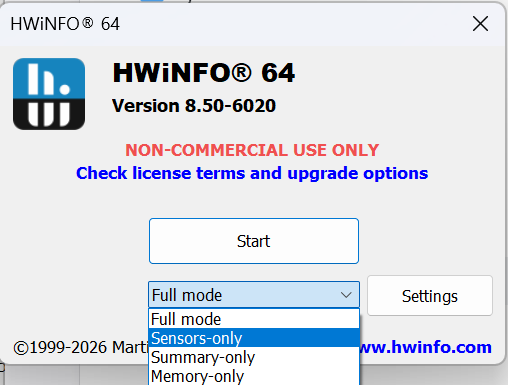
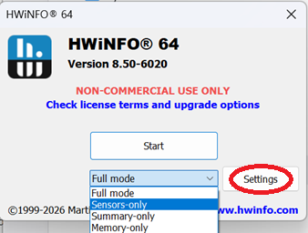
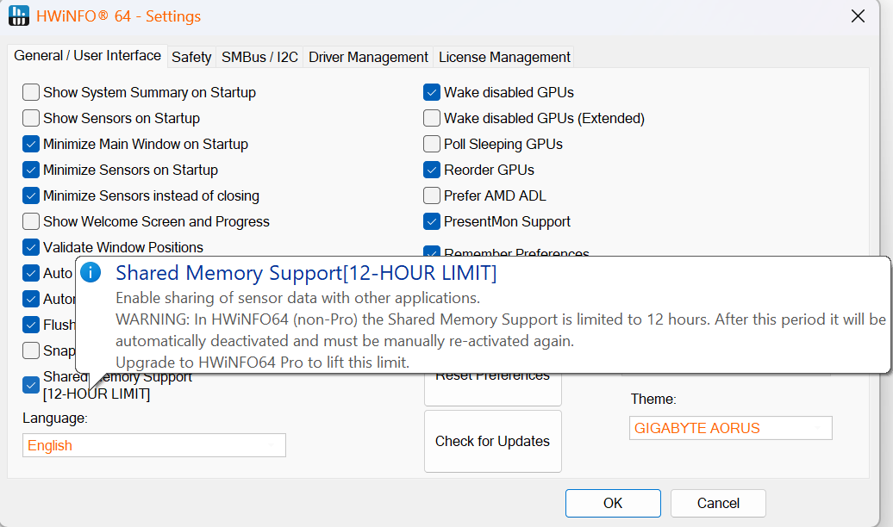

# HWiNFO Stream Deck Plugin

[](https://github.com/moeilijk/hwinfo-streamdeck/actions/workflows/build.yml)

Show live [HWiNFO64](https://www.hwinfo.com) sensor readings (temperatures, loads, clocks, fan speeds, and more) on your Elgato Stream Deck, as graphs, text, or both.


**Requirements:** Windows 10 or later, [HWiNFO64](https://www.hwinfo.com), Stream Deck software 6.9 or later. The Dial Carousel action requires a Stream Deck+.

This plugin reads HWiNFO exclusively. For Libre Hardware Monitor, remote machines, or Linux, use the [lhm-streamdeck](https://github.com/moeilijk/lhm-streamdeck) sister plugin instead.

## v3.0

The plugin core has been replaced with the actively developed engine from the [lhm-streamdeck](https://github.com/moeilijk/lhm-streamdeck) sister project. Existing tiles from v2.0.5 keep working after upgrading; the reading action and its settings are fully backwards compatible.

## Actions

- **Sensor Reading** — one reading per key: graph and/or text, custom colors, fonts, number formats, unit normalization, EMA smoothing, and per-tile update intervals
- **Composite Dashboard** — 2–4 readings on one key with overlaid graphs
- **Derived Metric** — formulas (sum, average, max, min, delta, pct) across 2–8 readings, with savable presets
- **Dial Carousel** — readings on the Stream Deck+ touch strip: rotate to cycle pages, multiple overview styles, page indicators
- **Settings** — polling rate, default tile appearance, and a shared global threshold library

All sensor pickers support search, category filtering, and favorites shared across tiles. Thresholds (colors, alert text, hysteresis, dwell, cooldown, snooze, sticky alarms) can be defined per tile or globally by sensor type.

## Enabling Support in HWiNFO64

> If the "portable" version of HWiNFO64 gives trouble with this plugin, use the installer version.

1. Download and install HWiNFO64, if you haven't already

    [HWiNFO Website](https://www.hwinfo.com)

2. Choose "Sensors-only" mode

    

3. Click "Settings"

    

4. Ensure "Shared Memory Support" is checked

    

5. (Optional) Recommended launch settings

    

6. Click "OK" then, "Run"

## Install and Setup the Plugin

1. Download the latest pre-compiled plugin

    [Plugin Releases](../../releases)

    > When upgrading, first uninstall: within the Stream Deck app choose "More Actions..." (bottom-right), locate "HWiNFO" and choose "Uninstall". Your tiles and settings will be preserved.

2. Double-click to install the plugin

3. Choose "Install" when prompted by Stream Deck

4. Locate the actions under the "HWiNFO" category in the action list

5. Drag one of the actions from the list to a tile in the canvas area

    

6. Configure the action to display the sensor reading you wish

    

    > Screenshots show the v2 configuration screen; v3 adds a searchable sensor picker with categories and favorites, appearance controls, and thresholds in the same panel.

## Troubleshooting

- **Tiles show "HWiNFO Unavailable" or "Please Launch HWiNFO64"** — HWiNFO is not running, is not in Sensors-only mode, or Shared Memory Support is off. Walk through the HWiNFO setup above; if the plugin doesn't recover immediately, quit and reopen HWiNFO64.
- **Tiles stop updating after ~12 hours** — the free version of HWiNFO disables Shared Memory Support 12 hours after enabling it. Restart HWiNFO (or re-enable the setting) to continue; a HWiNFO Pro license removes the limit. This is HWiNFO policy, not something the plugin can work around.
- **A tile shows no value after upgrading or after hardware changes** — the configured sensor may no longer exist under the same id. Open the tile's configuration and select the sensor and reading again.
- **Reporting a bug** — the plugin writes a log to `%APPDATA%\Elgato\StreamDeck\Plugins\com.exension.hwinfo.sdPlugin\hwinfo.log`; the last lines are usually enough to pinpoint the problem. Please attach them to your issue.

## Building from source

Requires Go, and for the HWiNFO shared-memory bridge a Windows C toolchain (on Linux/WSL: `mingw-w64`).

```sh
make plugin   # builds hwinfo.exe and hwinfo-bridge.exe into the .sdPlugin folder
make verify   # builds all targets, runs Go + Property Inspector tests, validates the manifest
make release  # packs build/com.exension.hwinfo.streamDeckPlugin
```

### Architecture

The Stream Deck plugin (`hwinfo.exe`) talks to a sensor bridge (`hwinfo-bridge.exe`) over gRPC
([hashicorp/go-plugin](https://github.com/hashicorp/go-plugin)); the bridge reads the HWiNFO shared memory.
For development without Windows/HWiNFO there is `cmd/mock-bridge`: the same gRPC interface with controllable
mock sensors (HTTP control API on `:9999`), used by the integration suites in `tests/integration/`
(`scripts/run-integration-tests.sh`, runs against a [DeckBridge](https://github.com/moeilijk/DeckBridge) emulator on Linux/WSL).

## History and credits

This plugin was created by [Shayne Sweeney](https://github.com/shayne) ([exension](https://github.com/exension)), who built it as a closed-source passion project, open-sourced it once HWiNFO opened up the shared memory interface, and maintained it through v2.0.5. In 2026 he handed the project over to [moeilijk](https://github.com/moeilijk), who maintains it today. Thanks, Shayne.
